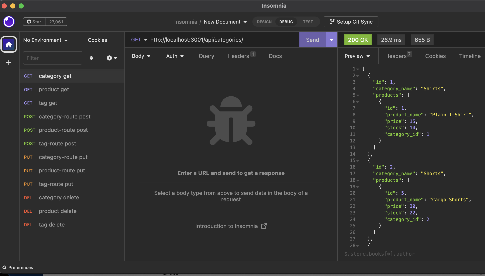

# 13 Object-Relational Mapping (ORM): E-Commerce Back End

This is project to build the back-end of an ecommerce site. 

## Table of contents

- [Overview](#overview)
  - [The challenge](#the-challenge)
  - [Screenshot](#screenshot)
  - [Links](#links)
- [My process](#my-process)
  - [Built with](#built-with)
  - [What I learned](#what-i-learned)
  - [Continued development](#continued-development)
  - [Useful resources](#useful-resources)
- [Author](#author)
- [Acknowledgments](#acknowledgments)


## Overview

### The challenge

Your task is to build the back end for an e-commerce site by modifying starter code. You’ll configure a working Express.js API to use Sequelize to interact with a MySQL database.

Because this application won’t be deployed, you’ll also need to provide a link to a walkthrough video that demonstrates its functionality and all of the acceptance criteria being met. You’ll need to submit a link to the video and add it to the readme of your project.

## User Story (Given in source coode)

```md
AS A manager at an internet retail company
I WANT a back end for my e-commerce website that uses the latest technologies
SO THAT my company can compete with other e-commerce companies
```

## Acceptance Criteria (Given in source code)

```md
GIVEN a functional Express.js API
WHEN I add my database name, MySQL username, and MySQL password to an environment variable file
THEN I am able to connect to a database using Sequelize
WHEN I enter schema and seed commands
THEN a development database is created and is seeded with test data
WHEN I enter the command to invoke the application
THEN my server is started and the Sequelize models are synced to the MySQL database
WHEN I open API GET routes in Insomnia for categories, products, or tags
THEN the data for each of these routes is displayed in a formatted JSON
WHEN I test API POST, PUT, and DELETE routes in Insomnia
THEN I am able to successfully create, update, and delete data in my database
```
## Walkthrough Video requirements: 
* The walkthrough video must show all of the technical acceptance criteria being met.

* The walkthrough video must demonstrate how to create the schema from the MySQL shell.

* The walkthrough video must demonstrate how to seed the database from the command line.

* The walkthrough video must demonstrate how to start the application’s server.

* The walkthrough video must demonstrate GET routes for all categories, all products, and all tags being tested in Insomnia.

* The walkthrough video must demonstrate GET routes for a single category, a single product, and a single tag being tested in Insomnia.

* The walkthrough video must demonstrate POST, PUT, and DELETE routes for categories, products, and tags being tested in Insomnia.

### Screenshot

Project tested in Insomnia

### Links

- Solution URL: [Github Repository](https://github.com/mariahw4/13-e-commerce-back-end)
- Walkthrough Video Link: [Google Drive Video Link](https://your-live-site-url.com)

## My process

### Built with

- JavaScript
- express (4.17.1)
- mysql2 (2.1.0)
- sequelize (5.21.7)
- dotenv (8.2.0)
- Insomnia

Installation Steps:
- create database from the mysql shell
- run 'npm i' to install dependencies
- 'npm run seed' to seed the database with source data
- 'npm start' to start application server
- different routes tested in Insomnia 

### What I learned

In this project I deepened and grew my knowledge of how to create and run routes through express. 

### Continued development

The continued development of this project would be to build and connect a front end and make this a full stack project.

### Useful resources

- [Sequelize Validators](https://sequelize.org/docs/v6/core-concepts/validations-and-constraints/) - This helped me know how to properly validate data.

## Author

- Website - [Mariah Wear](https://github.com/mariahw4/)
- LinkedIn - [Profile](https://www.linkedin.com/in/mariah-wear-7b1630255/)

## Acknowledgments

Big thanks to the instructional staff at UC Berkely Extension EdX!! 
